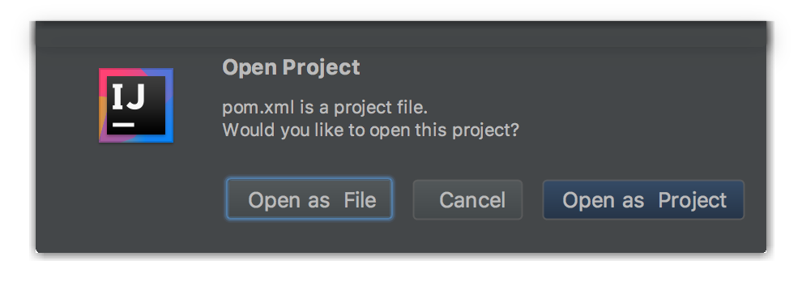

# Exercise 1 - Introduction

This exercise will get you started learning the basics of writing and running some tests in an IDE (Integrated Development Environemnt) using the JUnit testing framework.

We are going to assume you have IntelliJ Community Edition installed.

You will learn how to:

1. Set up your development environment
2. Create your first unit tests using JUnit
3. Structure your tests properly

## 1.1. Dev environment

> **Before you begin**: Please make sure that you have the following installed:
- IntelliJ Community Edition: [IntelliJ Community Edition](https://www.jetbrains.com/idea/download/)
- Java dev kit: [Java SE Development Kit](http://www.oracle.com/technetwork/java/javase/downloads/jdk8-downloads-2133151.html)


* Open `pom.xml` in IntelliJ by selecting **"Open"** in the Welcome screen:


* Then select **"Open as Project"**



This will create a IntelliJ project from the Maven `pom.xml`.

## 1.2 Creating your first unit tests

### Code example
In the introductory exercises you will be working with a simple, ready made example. The theme / "problem domain" is a smoothie bar that can blend different types of smoothies and keep track of the stock of ingredients. The smoothie bar is pretty limited, as they only use apples, oranges and bananas in smoothies, and can only serve three different kinds of smoothie: "Orange and apple smoothie", "Banana and apple smoothe" and "Orange and banana smoothie".

The code has the following structure:

- A `SmoothieKind` enum having three different enum values: `OrangeAndAppleSmoothie`, `BananaAndAppleSmoothe` and `OrangeAndBananaSmoothie`. Each smoothie has different recipes (how many apples, oranges and bananas required)
- A `Smoothie` representing the beverage that the bar can blend. It has information about what `SmoothieKind` it is, and what ingredients it consists of
- A `SmoothieBar` class representing the smoothie bar. It has these public methods:
  - `blend` - which takes `SmoothieKind` as a parameter and returns a `Smoothie`
  - `getApplesInStock`, `getOrangesInStock` and `getBananasInStock` which gets the current stock of ingredients
  - `restockApples`, `restockOranges` and  `restockBananas` which lets you add ingredients to the stock

We are going to focus on testing the `SmoothieBar`-class in the next exercises.

### Creating a `SmoothieBar` test class and a test

- To create a test class for the `SmoothieBar` class first use the Project window on the left side of the screen to open the `SmoothieBar` class in the Editor window. (If it's not visible it may be collapsed. If so, click the tab called "Project" on the left side of the screen.)
- To make things easy we are going to have IntelliJ create the test class for us by placing the cursor within the line containing the class declaration (`public class SmoothieBar...`) and press **`Alt+Enter`** (Windows/Linux users) or **`⌥⏎`** (Mac users)
- Choose **Create Test** from the suggestion list


- In the "Create Test" dialog, fill out the following:
 - Testing library: "JUnit4"
 - Class name: "SmoothieBarTest"
- Click **OK**


- An empty test class called `SmoothieBarTest` should now have been created in the `src\test` folder

We now have an empty test class with no test methods. To add a test method, create a method inside the `SmoothieBarTest` class with the following syntax:

```java
@Test
public void canBlendOrangeAndAppleSmoothie() {
  System.out.println("Hello Nerdschool!");
}
```

### Running tests
- Run it (show how using screenshots?), see it pass

### Creating more tests
- Create a second test using `assertTrue` that fails
- Make changes to the code under test to make test pass
- Run test, see it pass

## 1.3. Test structure

It is good practice to use the following structure when writing tests:

- _Given_
  - What should the world look like when the test happens?
  - The preconditions for the test
- _When_
  - What is being tested?
  - The behavior
- _Then_
  - What are the changes that happened?
  - The post-condition


- Identify the _Given_, _When_, _What_ sections of the tests you just wrote by inserting comments and line breaks to make it clearer.

### [Go to exercise 2 ==>](../exercise-2/README.md)
