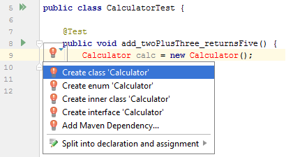
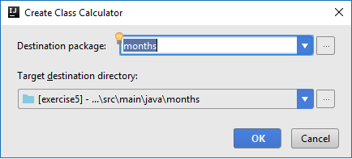
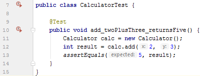

# Exercise 4 - Test Driven Development (TDD)

In this exercise we'll learn how to apply the TDD methodology when we're writing code.  

## What is TDD

Test Driven Development is a way of writing code where we will **always** (a-l-w-a-y-s) write tests for our code
**before** we write the implementation code.

But wait! This means our code won't even compile, silly! Why yes. Yes it does.

So how does this makes sense?

## How to do TDD

When following TDD, we always code in a certain pattern nicknamed "red-green-refactor".

### Red

First, we create a test.

Then, we start implementing the test based on how we plan the implementation to work. 

Why not leverage the power of IntelliJ to help us out creating things as we go? Use `ALT+ENTER` or click the light-bulb. 

Ensure it selects the correct package

Voila! The `Calculator.java` class and file has been created.

Let's continue in ``CalculatorTest.java``

I know I want an ``add`` function that takes two arguments and returns a value so I just start writing it so.

Again, there is no implementation, but I use ``ALT+ENTER`` to make IntelliJ create what I need.

I now have an ``Calculator`` class that looks like this without having to write anything myself.
 

Back in ``CalculatorTest`` I add the last line, the assert for the result.

I can finally run the test (``CTRL+SHIFT+F10`` when the cursor is on the test, or the icon in the gutter).
 
As expected, it fails because there is no actual implementation yet.

### Green

Now that we have a failing test, we can continue on to the next step - making it pass.

The only question you need to answer at this point: _what is the smallest amount of code I need to implement to make
this specific test pass?_

In the case of making the ``add()`` function work, it's quite simple

Run the test again, and it goes green!

### Refactor

Now that we have finished our test, we can refactor our code if necessary. Refactoring code just means to change
it's implementation details without changing it's behaviour. So we can change it, but our test should from now on always pass.

For the simple example we're using in these examples there's not much refactoring to do.

### Repeat

Now that ``add()`` is implemented, we can add more features to our calculator in the same way: 
Write the test, implement the feature, make the test pass, refactor.

## Tasks

Exercise 6 contains a skeleton for a simple ``MonthParser`` class. It has one function: `parseMonth(int numberOfMonth)`
which given a number returns a ``Month`` instance containing the month's name ("January", "February", etc) and the number of days
it contains.

**Do the following:**

- Open exercise6 pom.xml file as a project in IntelliJ
- Using TDD **only**, implement the ``parseMonth`` method.
- You should go through the red-green-refactor cycle 12 times in this exercise, one for each month.
- Copy & pasting code, or implementing more than one month at a time is strictly forbidden.
- There should be at least one test per possible month
- There should be tests making sure we cannot enter invalid numbers (only 1 through 12 allowed, no negative numbers).